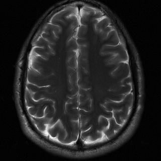

# Deep unrolling for learning optimal spatially varying regularisation parameters for Total Generalised Variation

This repository contains the code for the paper "..." (link to the paper) by ...


## Project status
This project is currently being tested.
- [ ] Test on a cluster to ensure that the code runs outside of the development environment.

## Requirements
Please see the `requirements.txt` file for the required packages.

## Quick start

If you have not installed the requirements:
```bash
# Assume you are in the root directory of the repository
# and, preferably, you are in a virtual environment.
pip install -r requirements.txt
```

Start training:
```bash
# Assume you are in the root directory of the repository
# and you have installed the requirements.
python scripts/mri/train.py --application mri --config config/example_mri_tgv_config.yaml --device cpu
# Change to cuda for GPU or mps for Apple processors.
# Set `--uses_wandb True` to use Weights and Biases.
```


## Description

(Let people know what your project can do specifically. Provide context and add a link to any reference visitors might be unfamiliar with. A list of Features or a Background subsection can also be added here. If there are alternatives to your project, this is a good place to list differentiating factors.)

The paper presents ... In the paper, we use ...

### Background

The overall approach works as follows...


which we then (approximately) solve with ...


The weights of the network...

Below, you can see exemplary results for ...


### Visuals

<!-- <div style="display: flex; justify-content: space-between;">

  <div style="text-align: left;">
    
    <p>k-data</p>
  </div>

  <div style="text-align: left;">
    
    <p>Zero-filled</p>
  </div>

  <div style="text-align: left;">
    
    <p>Scalar TGV</p>
  </div>

  <div style="text-align: left;">
    
    <p>U-TGV</p>
  </div>

  <div style="text-align: left;">
    
    <p>Ground truth</p>
  </div>

</div> -->

<!-- <p align="center">
  
  
  
  
  
</p> -->

<!-- <p align="center">
  <div style="display:inline-block; width:19%; text-align:center;">
    Block 1 Text
  </div>
  <div style="display:inline-block; width:19%; text-align:center;">
    Block 2 Text
  </div>
  <div style="display:inline-block; width:19%; text-align:center;">
    Block 3 Text
  </div>
  <div style="display:inline-block; width:19%; text-align:center;">
    Block 4 Text
  </div>
  <div style="display:inline-block; width:19%; text-align:center;">
    Block 5 Text
  </div>
</p> -->

<table style="border-collapse: collapse; width: 100%;">
  <tr>
    <td style="border: none; text-align: center; width: 20%;">
        </td>
    <td style="border: none; text-align: center; width: 20%;">
        </td>
    <td style="border: none; text-align: center; width: 20%;">
        </td>
    <td style="border: none; text-align: center; width: 20%;">
        </td>
    <td style="border: none; text-align: center; width: 20%;">
        </td>
  </tr>
  <tr>
    <td style="border: none; text-align: center;">k-data</td>
    <td style="border: none; text-align: center;">Zero-filled</td>
    <td style="border: none; text-align: center;">Scalar TGV</td>
    <td style="border: none; text-align: center;">U-TGV</td>
    <td style="border: none; text-align: center;">Ground truth</td>
  </tr>
</table>

## Installation
Within a particular ecosystem, there may be a common way of installing things, such as using Yarn, NuGet, or Homebrew. However, consider the possibility that whoever is reading your README is a novice and would like more guidance. Listing specific steps helps remove ambiguity and gets people to using your project as quickly as possible. If it only runs in a specific context like a particular programming language version or operating system or has dependencies that have to be installed manually, also add a Requirements subsection.

## Usage
Use examples liberally, and show the expected output if you can. It's helpful to have inline the smallest example of usage that you can demonstrate, while providing links to more sophisticated examples if they are too long to reasonably include in the README.

## Support
Please open an issue or email ttv22@cam.ac.uk.

## Roadmap
- [ ] Update README
- [ ] Add more doctests
    - [ ] Add test for CPU
    - [ ] Add test for CUDA
    - [ ] Add test for MPS

## Contributing
Please feel free to contribute.

For people who want to make changes to your project, it's helpful to have some documentation on how to get started. Perhaps there is a script that they should run or some environment variables that they need to set. Make these steps explicit. These instructions could also be useful to your future self.

You can also document commands to lint the code or run tests. These steps help to ensure high code quality and reduce the likelihood that the changes inadvertently break something. Having instructions for running tests is especially helpful if it requires external setup, such as starting a Selenium server for testing in a browser.

## Authors and acknowledgment
Big thanks to Kostas Papafitsoros, Andreas Kofler, and ...

This project used Github Copilot for generation of drafts, code snippets, and documentation, tests, ...

If you use the code for your work or if you found the code useful, please use the following BibTeX entry to cite the paper:

```
@article{...}
```

## License
- [ ] Add license
