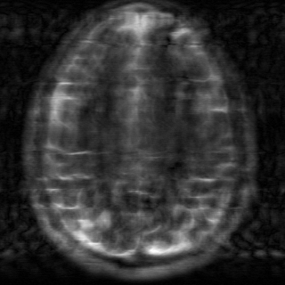
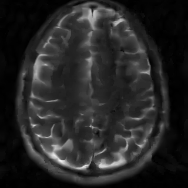

# Deep unrolling for learning optimal spatially varying regularisation parameters for Total Generalised Variation

<!-- ### Visuals -->

<!-- <div style="display: flex; justify-content: space-between;">

  <div style="text-align: left;">
    
    <p>k-data</p>
  </div>

  <div style="text-align: left;">
    
    <p>Zero-filled</p>
  </div>

  <div style="text-align: left;">
    
    <p>Scalar TGV</p>
  </div>

  <div style="text-align: left;">
    
    <p>U-TGV</p>
  </div>

  <div style="text-align: left;">
    
    <p>Ground truth</p>
  </div>

</div> -->

<!-- <p align="center">
  
  
  
  
  
</p> -->

<!-- <p align="center">
  <div style="display:inline-block; width:19%; text-align:center;">
    Block 1 Text
  </div>
  <div style="display:inline-block; width:19%; text-align:center;">
    Block 2 Text
  </div>
  <div style="display:inline-block; width:19%; text-align:center;">
    Block 3 Text
  </div>
  <div style="display:inline-block; width:19%; text-align:center;">
    Block 4 Text
  </div>
  <div style="display:inline-block; width:19%; text-align:center;">
    Block 5 Text
  </div>
</p> -->

<table style="border-collapse: collapse; width: 100%;">
  <tr>
    <td style="border: none; text-align: center; width: 19%;">
        </td>
    <td style="border: none; text-align: center; width: 19%;">
        </td>
    <td style="border: none; text-align: center; width: 19%;">
        </td>
    <td style="border: none; text-align: center; width: 20%;">
        </td>
    <td style="border: none; text-align: center; width: 19%;">
        </td>
  </tr>
  <tr>
    <td style="border: none; text-align: center;">k-data</td>
    <td style="border: none; text-align: center;">Zero-filled</td>
    <td style="border: none; text-align: center;">Scalar TGV</td>
    <td style="border: none; text-align: center;"><b>U-TGV</b></td>
    <td style="border: none; text-align: center;">Ground truth</td>
  </tr>
</table>


This repository contains the code for the paper "Deep unrolling for learning optimal spatially varying regularisation parameters for Total Generalised Variation" ([https://arxiv.org/abs/2502.16532](https://arxiv.org/abs/2502.16532)) by Thanh Trung Vu, Andreas Kofler, and Kostas Papafitsoros.


## Requirements
Please see the `requirements.txt` file for the required packages.
To create a new Python environment for this project, you can run the following commands:
```bash
# Create a new Python environment
python -m venv env_utgv
# Activate the environment
source env_utgv/bin/activate
# Install the required packages
pip install -r requirements.txt
```


## Quick start

If you have not installed the requirements:
```bash
# Assume you are in the root directory of the repository
# and, preferably, you are in a virtual environment.
pip install -r requirements.txt
```

To generate data [TODO: Add instructions to generate data]:
The instructions to generate the data will be added soon.

```bash
```

Alternatively, you can download the data from the following link [TODO: Add link to the data]:
We are waiting for permission from the owner to share the data.
Once that is done, we will add the link to the data.

Start training the model: The model can be trained using the script `train.py` in the `scripts/mri` directory. For example, to train the model for MRI reconstruction using the TGV regularisation with the config as defined in the `config/example_mri_tgv_config.yaml` file on the CPU, you can run the following command:
```bash
# Assume you are in the root directory of the repository
# and you have installed the requirements.
python scripts/mri/train.py --application mri --config config/example_mri_tgv_config.yaml --device cpu
# Change to cuda for GPU or mps for Apple processors.
# Set `--uses_wandb True` to use Weights and Biases.
```
There are different arguments that can be passed to the script.
You can see the list of arguments by running:
```bash
python scripts/mri/train.py --help
```
Here is the list of arguments as of the time of writing:
```bash
  --application {denoising,mri}
                        The application to run. Currently supporting 'denoising' and 'mri'.
  --config CONFIG       [Required] Path to the config file.
  --output_dir OUTPUT_DIR
                        The output directory to store the `.pth` state dict file and other logs. If provided, overwrite the
                        config.
  --device DEVICE       The device to use for training. If provided, overwrite the config. Recommend 'cuda' if GPU is
                        available.
  --uses_wandb USES_WANDB
                        Whether to use WandB for logging. Default to False.
  --logs_local LOGS_LOCAL
                        Whether to log locally. If provided without value, save the config and other logs locally. If not
                        provided, still save the config and other logs locally by default. Need to explicitly set to False
                        to disable.
  --savefile SAVEFILE   The file to save the model state dict and config.
  --loads_pretrained LOADS_PRETRAINED
                        Whether to load a pretrained model. Default to False.
```

Evaluate the model [TODO: Convert notebooks to a script to evaluate the model and produce the results]:
Download the pretrained models from [TODO: Add link to download the pretrained models].
The instructions to evaluate the model will be added soon.

```bash
```

You can also use the notebook `test_example.ipynb`
in `scripts/mri` to produce some example images.

## Description

### Abstract

We extend a recently introduced deep unrolling framework for learning spatially varying regularisation parameters in inverse imaging problems to the case of Total Generalised Variation (TGV). The framework combines a deep convolutional neural network (CNN) inferring the two spatially varying TGV  parameters with an unrolled algorithmic scheme that solves the corresponding variational problem. The two subnetworks are jointly trained end-to-end in a supervised fashion and as such the CNN learns to compute those parameters that drive the reconstructed images as close to the ground truth as possible. Numerical results in image denoising and MRI reconstruction show a significant qualitative and quantitative improvement compared to the best TGV scalar parameter case as well as to other approaches employing spatially varying parameters computed by unsupervised methods.
We also observe that the inferred spatially varying parameter maps have a consistent structure near the image edges, asking for further theoretical investigations. In particular, the parameter that weighs the first-order TGV term has a triple-edge structure with alternating high-low-high values whereas the one that weighs the second-order term attains small values in a large neighbourhood around the edges.

### Introduction

In inverse imaging problems, variational regularisation  problems of the type

$$
\min_{u\in X} \ \mathcal{D}(Au,f)+ \mathcal{R}(u;\mathrm{\Lambda})  \tag{1}
$$

are widely used to compute an estimation $u\in X$, $X$ being a Banach space, of some ground truth imaging data $u_{\mathrm{true}}$ given data $f$ that satisfy the equation

$$
f=Au_{\mathrm{true}}+\eta. \tag{2}
$$

Here $A$ denotes the forward operator of the, typically ill-posed, inverse problem and $\eta$ is a random noise component.
Solving $(1)$ using spatially varying regularisation parameters $\Lambda$, instead of scalar ones,
has been the subject of many  works.
The target  is to compute and subsequently use a regularisation parameter  $\mathrm{\Lambda}: \Omega \to (\mathbb{R}_{+})^{\ell}$ that balances the data fidelity  $\mathcal{D}$ and the - in general $\ell$ components - of the regularisation term $\mathcal{R}$ with a different strength at every point $x\in \Omega \subset \mathbb{R}^{d}$ (pixel in the discrete setting).

In the case where $\mathcal{R}(u)=\mathrm{TV}(u)$, the Total Variation of the (grayscale) function $u: \Omega \to \mathbb{R}$ and assuming Gaussian noise, problem \eqref{intro:general_min} amounts to

$$
\min_{u \in X} \ \frac{1}{2} \| Au - f \|\_{L^2(\Omega)}^{2} + \int\_{\Omega} \Lambda (x) d |Du|. \tag{3}
$$

Small values of $\Lambda: \Omega \to \mathbb{R}_{+}$ impose little local regularity and are thus suitable for preserving detailed parts of the image and edges. On the other hand, high values of $\Lambda$  impose large regularity and are preferable for smooth, homogeneous areas.

For higher-order extensions of TV, especially those defined in an infimal convolution manner, the role and the interplay of spatially varying regularisation parameters on the resulting image quality and structure are not as straightforward. A prominent example is the Total Generalised Variation (TGV)

$$
\text{TGV}\_{\Lambda_{0}, \Lambda_{1}}(u):=\min_{w\in \mathrm{BD}(\omega)} \int_{\Omega} \Lambda_{1}(x) d|Du-w| + \int_{\Omega} \Lambda_{0}(x)d|\mathcal{E}w|,
$$

where $\Lambda: \Omega \to (\mathbb{R}\_{+})^{2}$, with $\Lambda=(\Lambda_{0}, \Lambda_{1})$. Here, $\mathcal{E}$ denotes the measure that represents the distributional symmetrised gradient of $w\in \mathrm{BD}(\Omega)$, the space of functions of bounded deformations.
The combined values of $\Lambda_{0}$ and $\Lambda_{1}$ not only regulate the regularisation intensity but also control the staircasing effect, which is a characteristic limitation of  TV, with suitable values of these parameters promoting piecewise affine structures.

### Contribution

Here, we adapt the approach introduced in "Learning Regularization Parameter-Maps for Variational Image Reconstruction using Deep Neural Networks and Algorithm Unrolling" https://arxiv.org/abs/2301.05888 to compute spatially varying regularisation maps for TGV. It involves training a network that consists of two subnetworks in a supervised fashion. The first subnetwork is a deep convolutional neural network (CNN),
that takes as an input the data $f$
and outputs the maps $\Lambda_{0}, \Lambda_{1}$. To tie these maps to the variational problem, they are fed into an appended second subnetwork, an unrolled PDHG algorithm, that solves the TGV minimisation problem considering the regularisation maps to be fixed. The entire network is trained end-to-end with pairs  $(f^{i}, u_{\mathrm{true}}^{i})$ and thus, the CNN is implicitly trained to output those maps that drive the approximate solution $u^{i}$ of the variational problem as close to $u_{\mathrm{true}}^{i}$ as possible.
Since the CNN is expressive enough, given some new data $f^{\mathrm{test}}$, it is able to produce meaningful parameter-maps adapted to $f^{\mathrm{test}}$. We show that this approach produces far better results than similar approaches in image denoising and MR image reconstruction, significantly boosting the performance of TGV. We also show that in contrast to the TV, the structure of the resulting TGV parameter maps is non-trivial and asks for further theoretical investigation.


<!-- ## Installation -->
<!-- Within a particular ecosystem, there may be a common way of installing things, such as using Yarn, NuGet, or Homebrew. However, consider the possibility that whoever is reading your README is a novice and would like more guidance. Listing specific steps helps remove ambiguity and gets people to using your project as quickly as possible. If it only runs in a specific context like a particular programming language version or operating system or has dependencies that have to be installed manually, also add a Requirements subsection. -->

<!-- ## Usage -->
<!-- Use examples liberally, and show the expected output if you can. It's helpful to have inline the smallest example of usage that you can demonstrate, while providing links to more sophisticated examples if they are too long to reasonably include in the README. -->

## Support
Please open an issue or email ttv22@cam.ac.uk.

## Roadmap
- [ ] Add description of the data: training, validation, and test data
- [ ] Add instructions to generate data
- [ ] Add link to download the data
- [ ] Add link to download the pretrained models
- [ ] Convert notebooks in `notebooks/mri` to scripts to evaluate the model and produce the results (for example, the `generate_results.ipynb` notebook)
- [ ] Clean up the notebook `test_example.ipynb`
- [ ] Create readthedocs documentation
<!-- - [ ] Update README
- [ ] Add more doctests
    - [ ] Add test for CPU
    - [ ] Add test for CUDA
    - [ ] Add test for MPS -->

## Contributing
<!-- Please feel free to contribute.

For people who want to make changes to your project, it's helpful to have some documentation on how to get started. Perhaps there is a script that they should run or some environment variables that they need to set. Make these steps explicit. These instructions could also be useful to your future self.

You can also document commands to lint the code or run tests. These steps help to ensure high code quality and reduce the likelihood that the changes inadvertently break something. Having instructions for running tests is especially helpful if it requires external setup, such as starting a Selenium server for testing in a browser. -->

## Citation and Acknowledgement

<!-- ## Authors and acknowledgment
Big thanks to Kostas Papafitsoros, Andreas Kofler, and

This project used Github Copilot for generation of drafts, code snippets, and documentation, tests, ... -->

If you use the code for your work or if you found the code useful, please use the following BibTeX entry to cite the paper:

```
@article{...}
```

<!-- ## License
- [ ] Add license -->
